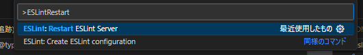

# my-nuxt3-and-eslint-update-example

## このリポジトリについて
 - 最新のESLint(FlatConfig)への移行について自前のNuxt3環境の一部を抜き出し検証したときのリポジトリ
 - フォーマッターとしてESLintと併用していた[Prettier](https://prettier.io/)は移行先となるNuxt3のモジュール内のドキュメントとして紹介されている[ESLint Stylistic](https://eslint.style/)に移行する
   - 必ずしもPrettierから移行する必要はないけど、パッケージの管理や設定がシンプルになるので特に理由が無ければ移行するのがよさそう

## ESLintのNuxt関連パッケージについて

Nuxt ESLintのFAQページが分かりやすい(2024/06/19)

## 手順
作業前のpackage.json
```json
{
  "private": true,
  "scripts": {
    "build": "NITRO_PRESET=node-server nuxt build",
    "dev": "nuxt dev",
    "generate": "nuxt generate",
    "preview": "nuxt preview",
    "postinstall": "nuxt prepare",
    "lint": "eslint --ext .js,.ts,.vue --ignore-path .gitignore .",
    "lint:fix": "eslint --fix --ext .js,.ts,.vue --ignore-path .gitignore ."
  },
  "devDependencies": {
    "@nuxt/eslint-config": "^0.2.0",
    "@nuxtjs/supabase": "^1.1.4",
    "@pinia-plugin-persistedstate/nuxt": "^1.2.0",
    "@pinia/nuxt": "^0.5.1",
    "@typescript-eslint/eslint-plugin": "^6.16.0",
    "@vueuse/core": "^10.7.0",
    "@vueuse/nuxt": "^10.7.0",
    "eslint": "^8.56.0",
    "eslint-config-prettier": "^8.6.0",
    "fs-extra": "^11.1.0",
    "nuxt": "^3.9.0",
    "nuxt-primevue": "^0.2.2",
    "pinia": "^2.1.7",
    "prettier": "^2.8.3",
    "primeflex": "^3.3.1",
    "primeicons": "^6.0.1",
    "primelocale": "^0.0.1",
    "sass": "^1.57.1",
    "typescript": "^5.3.3",
    "vue-gtag-next": "^1.14.0"
  },
  "overrides": {
    "vue": "latest"
  }
}
```

1. パッケージについて新しいものに入れ替える
```
$ npm remove eslint @nuxt/eslint-config eslint-config-prettier prettier
$ npx nuxi module add eslint
```
- [prettier](https://prettier.io/)は`@nuxt/eslint`のドキュメント内で紹介されている[ESLint Stylistic](https://eslint.style/)に乗り換えるため併せてアンインストールする
- 新しい方は公式に書いてあるクイックセットアップのコマンド操作により実施(`nuxt.config.ts`へのモジュールを読み込むための追加が行われる)

2. 一度Viteの開発サーバーを起動(`npm run dev`)
- この操作により`@nuxt/eslint`モジュールが読み込まれ次の手順で必要となるファイル(`.nuxt/eslint.config.mjs`)が生成される
- `npx nuxi prepare`でもOKのはず

3. `.eslintrc.js`を元に`eslint.config.mjs`を作成
- `.prettierignore`に記載していたSupabaseのTypeScrpt用の型定義ファイル(`types/database.types.ts`)

4. `nuxt.config.ts`でESLint Stylisticを有効化
```diff
export default defineNuxtConfig({
+  eslint: {
+    config: {
+      stylistic: {
+        indent: 2,
+        semi: true,
+        quotes: "double",
+      },
+    },
+  },
});
```
- prettierの代わりになるため出来るだけ元の設定に揃えるのが良いかも
- `.prettierrc`の設定内容を元にstylistic側の設定について記載

5. VSCodeの設定ファイル(`.vscode/settings.json`)を修正
```diff
{
-  "editor.formatOnSave": true,
-  "editor.defaultFormatter": "esbenp.prettier-vscode",
+  "eslint.useFlatConfig": true,
+  "editor.formatOnSave": false,
+  "editor.codeActionsOnSave": {
+    "source.fixAll.eslint": "explicit"
+  },
  "[markdown]": {
    "editor.formatOnSave": false,
    "files.trimTrailingWhitespace": false
  },
-  "prettier.configPath": ".prettierrc",
-  "prettier.ignorePath": ".prettierignore"
}
```
- 参考：[FAQ | ESLint Stylistic](https://eslint.style/guide/faq#vs-code)
- [VSCode側のESLint拡張](https://marketplace.visualstudio.com/items?itemName=dbaeumer.vscode-eslint)の作業当時のバージョンは`v3.0.10`
- FlatConfigをVSCodeで有効化する方法はVSCode側の拡張機能のバージョンによって異なる模様
  - `eslint.experimental.useFlatConfig`と紹介されている記事も多いがこれは8.21～8.57で有効な設定みたい
  - 最新のバージョンでは`"eslint.useFlatConfig": true`という記述が正しいみたい
  - ↑の件は`settings.json`でワーニングが出るので指示通りに修正すればOK
  - リリースノートによるとv3.0.5のリリースで`eslint.useFlatConfig`が追加されたみたいなので古いバージョンの場合は更新すると良い

6. 不要となったファイルを削除
```
$ rm -f .eslintrc.js .prettierignore .prettierrc
```

7. package.jsonのnpmスクリプト修正
```diff
  "scripts": {
-    "lint": "eslint --ext .js,.ts,.vue --ignore-path .gitignore .",
-    "lint:fix": "eslint --fix --ext .js,.ts,.vue --ignore-path .gitignore ."
+    "lint": "eslint .",
+    "lint:fix": "eslint . --fix"
  },
```
- 最新のESLint CLIでは`--ext`,`--ignore-path`オプションが削除されたみたい？(`--help`を付けても存在しない、アップデート前は未確認)
- 以前のオプションを付けたままだと`Invalid option '〇〇'`のエラーが出てしまうため公式のガイドに記載のシンプルなコマンドに修正

8. `npm run lint`と`npm run lint:fix`を実行しESLintのチェックが働くことを確認
- 注意点として`nuxt.config.ts`内のeslintの設定は修正を反映するのにViteの開発サーバーの起動(`npm run dev`) or `npx nuxi prepare`の実行が必要みたい
- `nuxt.config.ts`のESLintの設定は頻繁に変えるものではないが、`lint:fix`スクリプトの先頭でprepareを実行しても良いかも

9. Prettierの拡張機能についてレコメンドの設定をしているのでこちらも修正(`.vscode/extensions.json`)
```diff
{
  "recommendations": [
-    "esbenp.prettier-vscode",
    "vue.volar",
    "dbaeumer.vscode-eslint",
    "redhat.vscode-yaml"
  ],
  "unwantedRecommendations": []
}
```

---
作業前後のpackage.json
```diff
{
  "private": true,
  "scripts": {
    "build": "NITRO_PRESET=node-server nuxt build",
    "dev": "nuxt dev",
    "generate": "nuxt generate",
    "preview": "nuxt preview",
    "postinstall": "nuxt prepare",
-    "lint": "eslint --ext .js,.ts,.vue --ignore-path .gitignore .",
-    "lint:fix": "eslint --fix --ext .js,.ts,.vue --ignore-path .gitignore ."
+    "lint": "eslint .",
+    "lint:fix": "eslint . --fix"
  },
  "devDependencies": {
-    "@nuxt/eslint-config": "^0.2.0",
+    "@nuxt/eslint": "^0.3.13",
    "@nuxtjs/supabase": "^1.1.4",
    "@pinia-plugin-persistedstate/nuxt": "^1.2.0",
    "@pinia/nuxt": "^0.5.1",
    "@typescript-eslint/eslint-plugin": "^6.16.0",
    "@vueuse/core": "^10.7.0",
    "@vueuse/nuxt": "^10.7.0",
-    "eslint": "^8.56.0",
-    "eslint-config-prettier": "^8.6.0",
    "fs-extra": "^11.1.0",
    "nuxt": "^3.9.0",
    "nuxt-primevue": "^0.2.2",
    "pinia": "^2.1.7",
-    "prettier": "^2.8.3",
    "primeflex": "^3.3.1",
    "primeicons": "^6.0.1",
    "primelocale": "^0.0.1",
    "sass": "^1.57.1",
    "typescript": "^5.3.3",
    "vue-gtag-next": "^1.14.0"
  },
  "overrides": {
    "vue": "latest"
  }
}
```

## 備考
- ESLintの設定(`nuxt.config.ts`のStylisticのルール)について変更し、`npx nuxi prepare`を実行しても起動中のエディタは以前の設定を読み込んでいる模様
  - コマンドパレット(`Ctrl+Shift+P`)から`ESLint: Restart ESLint Server`を実行するか`Developer: Reload Window`を行うことで解決できる



## 参考情報
- [ESLint Module - Nuxt ESLint](https://eslint.nuxt.com/packages/module)
  - `@nuxt/eslint`モジュールに関する公式のドキュメント
- [FAQ - Nuxt ESLint](https://eslint.nuxt.com/guide/faq)
  - 同公式ドキュメントのNuxtに関連する複数個のパッケージについて纏まっているページ
- [Nuxt3で「eslintrcとprettier」から「flat configとeslint stylistic」へ移行した話](https://zenn.dev/gerunda/articles/20240430-nuxt-eslint-flat-config-migration)
  - 移行作業中に見つけた参考ページ1
- [Nuxt3のLinterは Nuxt ESLint で整備する (マイグレーションあり)](https://zenn.dev/comm_vue_nuxt/articles/setup-nuxt-eslint)
  - 移行作業中に見つけた参考ページ2