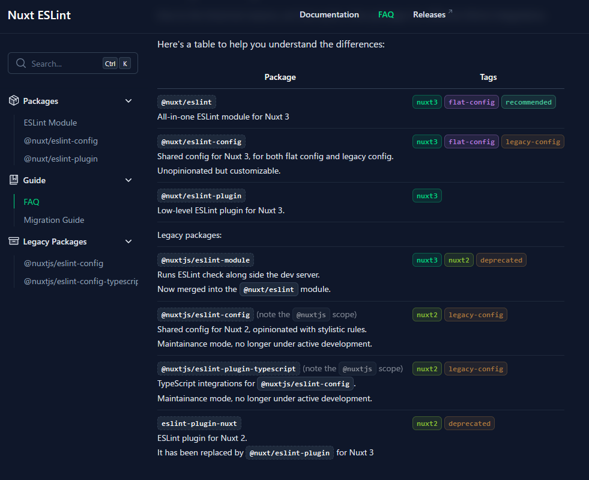

# my-nuxt3-and-eslint-update-example

## このリポジトリについて
 - 最新のESLint(FlatConfig)への移行について自前のNuxt3環境の一部を抜き出し検証したときのリポジトリ
 - フォーマッターとしてESLintと併用していた[Prettier](https://prettier.io/)は移行先となるNuxt3のモジュール内のドキュメントとして紹介されている[ESLint Stylistic](https://eslint.style/)に移行する
   - 必ずしもPrettierから移行する必要はないけど、パッケージの管理や設定がシンプルになるので特に理由が無ければ移行するのがよさそう

## ESLintのNuxt関連パッケージについて

Nuxt ESLintのFAQページが分かりやすい(2024/06/19)

## 参考情報
- [ESLint Module - Nuxt ESLint](https://eslint.nuxt.com/packages/module)
  - `@nuxt/eslint`モジュールに関する公式のドキュメント
- [FAQ - Nuxt ESLint](https://eslint.nuxt.com/guide/faq)
  - 同公式ドキュメントのNuxtに関連する複数個のパッケージについて纏まっているページ
- [Nuxt3で「eslintrcとprettier」から「flat configとeslint stylistic」へ移行した話](https://zenn.dev/gerunda/articles/20240430-nuxt-eslint-flat-config-migration)
  - 移行作業中に見つけた参考ページ